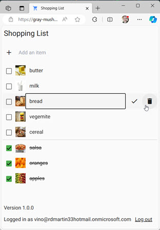

# Shopping List

A simple shopping list app built with cloud native Azure services, including Static Web Apps with Angular, Azure Functions,
Cosmos DB, Azure Bing Search and Microsoft Account social login.

This repo can be forked and deployed to your own Azure subscription using entirely free Azure offerings. Share it with
your family and friends. Each user gets their own shopping list and can add, edit and delete items.

[View the live demo](https://gray-mushroom-02481ed10.4.azurestaticapps.net/list)

[View video overview](https://youtu.be/6DAEaxzlybw?si=ejPLThNC9wCBBhSr)

&nbsp;&nbsp;&nbsp;&nbsp;&nbsp;&nbsp;

### Features

- Add, edit and delete items using optimized keyboard navigation
- Images are automatically added using Bing Search
- Automatic dark and light theme support based on your device settings
- Uses Microsoft Account for social login
- Responsive design for mobile and desktop

## Requirements

To run it locally, you'll need:

- [Bing Search account in Azure](https://www.microsoft.com/en-us/bing/apis/bing-web-search-api)
- [Cosmos DB database](https://learn.microsoft.com/en-us/azure/cosmos-db/nosql/quickstart-portal)
  named `ToDoList` with a container named `Items`
- Microsoft Account (for logging in)
- [Static Web Apps CLI](https://azure.github.io/static-web-apps-cli/) (for running it)

## Running it locally

Before running it the first time, you'll need to configure it for your Cosmos DB and Bing Search subscription. Acquire the keys
from the [Azure Portal](https://portal.azure.com/) and enter them into appSettings.json or a local
[secrets.json](https://learn.microsoft.com/en-us/aspnet/core/security/app-secrets) file.

> ⚠️ WARNING: Do not commit `appSettings.json` to source control with your secrets.

Run `npx swa start` to run both the front and back end pieces, then navigate to http://localhost:4280 in a browser. Note that
any breakpoints you set in the C# code will not be hit.

To allow debugging the API services and support hot reload, use Visual Studio to open `api.csproj` and start a debugging session. It is expected this will start the API on port 7135 (http://localhost:7135/).

Then run this command in a VSCode terminal:

`npx swa start http://localhost:4200 --run "npm start" --api-devserver-url http://localhost:7135/`

Or use the shortcut defined in `package.json`:

`npm run start:swa-no-api`
