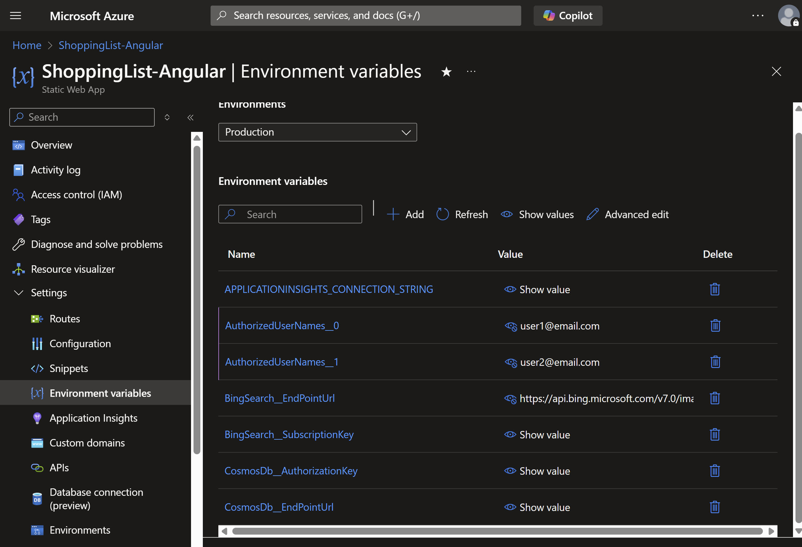

# Shopping List

A shopping list app optimized for efficiency and practicality. It does what a shopping list should do and not a darn
thing more.

Built with cloud-native Azure services, including Static Web Apps with Angular, Azure Functions, Cosmos DB and Azure Bing Search.

This repo can be forked and deployed to your own Azure subscription using entirely free Azure offerings. Share it with
your family and friends. Each user gets their own shopping list and can add, edit and delete items.

&nbsp;&nbsp;&nbsp;&nbsp;&nbsp;&nbsp;

### Features

- Add, edit and delete items using optimized keyboard navigation
- Images are automatically added using Bing Search
- Automatic dark and light theme support based on your device settings
- Responsive design for mobile and desktop
- Simplified, white-listed usernames for authentication. No passwords to remember.

  > ⚠️ WARNING: The list of authorized usernames is stored in the Azure Static Web App configuration and not discoverable
  > by a malicious user unless they are able to correctly guess it. To increase security, use impossible to guess usernames.
  > To really increase security, swap in Microsoft Account authentication, which was used in [version 1.2.0](https://github.com/rdogmartin/ShoppingList.Angular/releases/tag/v1.2.0).

## Requirements

To run it locally, you'll need:

- [Bing Search account in Azure](https://www.microsoft.com/en-us/bing/apis/bing-web-search-api)
- [Cosmos DB database](https://learn.microsoft.com/en-us/azure/cosmos-db/nosql/quickstart-portal)
  named `ToDoList` with a container named `Items`
- Microsoft Account (for logging in)
- [Static Web Apps CLI](https://azure.github.io/static-web-apps-cli/) (for running it)

## Running it locally

Before running it the first time, you'll need to configure it to specify the allowed usernames and connection information for your Cosmos DB and Bing Search subscription.
Acquire the keys from the [Azure Portal](https://portal.azure.com/) and enter them into `appsettings.json` or a local
[secrets.json](https://learn.microsoft.com/en-us/aspnet/core/security/app-secrets) file.

> ⚠️ WARNING: `AuthorizedUserNames` is a comma-separated list of usernames that are allowed to log in to the application. The authentication system running in an Azure Function lets a user in if they type a string that matches one of these values. Each username can be any type of string. Use email addresses for simplicity or complex strings such as GUIDs for increased security.

> ⚠️ WARNING: Do not commit `appsettings.json` to source control with your secrets.

Run `npx swa start` to run both the front and back end pieces, then navigate to http://localhost:4280 in a browser. Note that
any breakpoints you set in the C# code will not be hit.

> 💡 TIP: `swa` is part of the [Static Web Apps CLI](https://azure.github.io/static-web-apps-cli/), so be sure to install that.

To allow debugging the API services and support hot reload, use Visual Studio to open `api.csproj` and start a debugging session. It is expected this will start the API on port 7135 (http://localhost:7135/).

Then run this command in a VSCode terminal:

`npx swa start http://localhost:4200 --run "npm start" --api-devserver-url http://localhost:7135/`

Or use the shortcut defined in `package.json`:

`npm run start:swa-no-api`

## Deploying to your own Azure subscription

1. Create a [Static Web App](https://learn.microsoft.com/en-us/azure/static-web-apps/overview) in the Azure Portal.
1. If you haven't already done so already, create a
   [Bing Search account in Azure](https://www.microsoft.com/en-us/bing/apis/bing-web-search-api) and a
   [Cosmos DB database](https://learn.microsoft.com/en-us/azure/cosmos-db/nosql/quickstart-portal)
   named `ToDoList` with a container named `Items`.

   > 💡 TIP: This application works with the free tier of each Azure service, so no out of pocket costs are required.

1. In the Azure Portal, navigate to the Configuration page for your Static Web App. Create four new application settings
   with the following names and values:

   - `AuthorizedUserNames` - A list of usernames who are allowed to log in. In `appsettings.json` and `secrets.json`, this is
     a comma-separated list of strings. In the Azure Static Web App configuration, each username is a separate entry with `__X` appended to the name, where `X` is a number starting at 0. For example, `AuthorizedUserNames__0`, `AuthorizedUserNames__1`, etc.
   - `BingSearch__EndpointUrl` - The URL of your Bing Search service. Find it on the Keys and Endpoint page of your Bing Search
     service.
   - `BingSearch__SubscriptionKey` - Your Bing Search subscription key. Find it on the Keys and Endpoint page of your Bing
     Search service.
   - `CosmosDb__AuthorizationKey` - Your Cosmos DB authorization key. Find it on the Keys page of your Cosmos DB database.
   - `CosmosDb__EndpointUrl` - Your Cosmos DB endpoint URI. Find it on the Keys page of your Cosmos DB database.

   

1. Fork this repo.
1. In your forked repo, create a new GitHub Actions secret named `AZURE_STATIC_WEB_APPS_API_TOKEN` with the value
   of the deployment token from the Static Web App you created in step 1. This links your repo to your Azure Static Web App.
   [More info](https://learn.microsoft.com/en-us/azure/static-web-apps/deployment-token-management)

1. Create an arbitrary commit and push your changes to GitHub. The GitHub Action will build and deploy your app to Azure.
   You can view the progress in the Actions tab of your repo.
